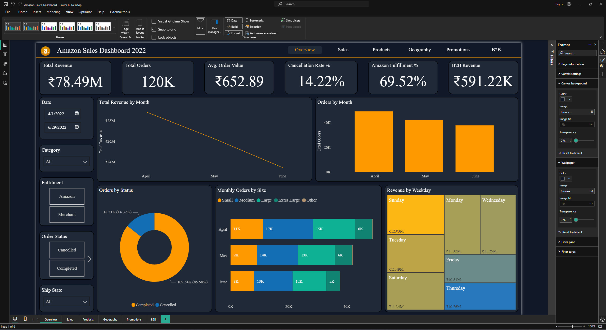

## Dashboard Preview



# Amazon Sales Dashboard: E-commerce Analytics & Insights

## 📊 Project Overview

- **Objective:** Build an end-to-end Amazon sales analytics solution to explore sales trends, product performance, fulfillment patterns, and geographic distribution.
- **Scope:** Amazon India sales data for fashion products from April-June 2022 with order-level granularity.
- **Approach:** Python (Jupyter + `pandas`, `numpy`, `matplotlib`) for cleaning and feature engineering. Power BI for dashboarding and reporting.

---

## 📁 Dataset Information

### `Amazon_Sales_Report.csv`

Order-level sales data from Amazon India marketplace.

- **Columns:**  
  `Order ID`, `Date`, `Status`, `Fulfilment`, `Sales Channel`, `ship-service-level`, `Style`, `SKU`, `Category`, `Size`, `ASIN`, `Courier Status`, `Qty`, `currency`, `Amount`, `ship-city`, `ship-state`, `ship-postal-code`, `ship-country`, `promotion-ids`, `B2B`, `fulfilled-by`

- **Key Metrics:**
  - Order details (ID, date, status)
  - Product information (category, size, style, SKU)
  - Fulfillment data (type, service level, courier status)
  - Financial data (amount, quantity, currency)
  - Geographic data (city, state, postal code)
  - Business type (B2B flag, promotions)

---

## 🎯 Project Goals

- Clean and preprocess the raw sales dataset.
- Perform exploratory data analysis to identify sales trends and patterns.
- Build an interactive dashboard to surface actionable insights.
- Analyze product performance, geographic trends, and fulfillment efficiency.

---

## 🛠️ Tools and Technologies

| Component         | Tool/Library Used                          |
|------------------|--------------------------------------------|
| **Python Libraries** | `pandas`, `numpy`, `matplotlib` |
| **BI Tool**          | Power BI                                   |
| **Notebooks**        | Jupyter Notebook                           |
| **Version Control**  | GitHub                                     |

---

## 📂 Folder Structure

``` 
Amazon_sales_dashboard / 
│ 
├── README.md 
├── DATA_CLEANING_SUMMARY.md
├── FEATURE_ENGINEERING_SUMMARY.md
├── data/ 
│   ├── raw/ 
│   │   └── Amazon_Sales_Report.csv
│   └── processed/ 
│       └── Amazon_Sales_cleaned.csv
├── notebooks/ 
│   └── 01_data_cleaning_amazon_sales.ipynb 
├── powerbi/ 
│   ├── Amazon_Sales_Dashboard.pbix 
│   ├── DAX_README.md
│   └── screenshots/ 
└── assets/
```

---

## 🔄 Project Steps

1. Open the notebook `notebooks/01_data_cleaning_amazon_sales.ipynb` and run all cells.
2. The notebook loads raw CSV from `data/raw/`, cleans and engineers features, then saves to `data/processed/`.
3. Import the processed CSV into Power BI to build visuals and KPIs.
4. Use `powerbi/DAX_README.md` for exact measure formulas and `powerbi/SETUP_GUIDE.md` for visual mappings.

---

## 🧹 Data Cleaning and Preprocessing

- **Consistent schema:** Columns standardized to `snake_case` format.
- **Critical nulls handled:** Dropped rows missing keys (e.g., `order_id`, `date`). Valid blanks retained (e.g., `courier_status` for pending orders, `amount` for cancelled orders).
- **Deduplication:** Row-level duplicates removed.
- **Date parsing:** Date field converted to datetime; invalid strings coerced and dropped when critical.
- **Category standardization:** Whitespace trimmed and values title-cased (e.g., `Status`, `Category`, `Fulfilment`, `Size`).
- **Validations:** Amount and quantity fields checked for negative values; removed where invalid.
- **Boolean conversion:** B2B flag converted to proper boolean type.

### Feature Engineering Highlights
- **Date features:** Year, month, quarter, day of week, month name, day name, season
- **Calculated metrics:** Unit price, order status categories, size categories
- **Binary flags:** is_cancelled, is_completed, is_b2b, is_amazon_fulfilled, is_merchant_fulfilled, has_promotion, is_weekend
- **Aggregations:** Orders per location, category-level sales (total, average, count), state-level sales
- **Time-based:** Season classification, weekend identification
- **Product categorization:** Size grouping (Small, Medium, Large, Extra Large)

---

## 📊 Dashboard Development

### Power BI Model
- **Data source:** `data/processed/Amazon_Sales_cleaned.csv`
- **Model:** Single fact table `Amazon_Sales_cleaned` with 48 engineered columns
- **Date handling:** Uses fact table date; no separate DimDate table required
- **Measures folder:** **DAX Formulas** (41 total measures)

### Key Measures (41 total)

**Base (4)**
- Total Revenue, Total Orders, Total Quantity, Average Order Value (AOV)

**Status (4)**
- Cancelled Orders, Completed Orders, Cancellation Rate %, Completion Rate %

**Fulfillment (5)**
- Amazon Orders, Merchant Orders, Amazon Fulfillment %, Amazon Revenue, Merchant Revenue

**B2B (8)**
- B2B Orders, B2C Orders, B2B Revenue, B2C Revenue, B2B Revenue %, B2B AOV, B2C AOV

**Promotions (6)**
- Promo Orders, Non-Promo Orders, Promo Revenue, Non-Promo Revenue, Promo Share of Orders %, Promo Revenue %

**Weekend (3)**
- Weekend Revenue, Weekday Revenue, Weekend Share %

**Product/Category (4)**
- Revenue by Category, Orders by Size Category, Top SKU Revenue, Unit Price (Avg)

**Geography (2)**
- Revenue by State, Orders by City

**Operations (2)**
- Cancellation Rate % by Month, Status Count

### Formatting
- Currency: INR with Hindi culture (`"₹"#,0.00`)
- Percentages: `0.00%` format
- Whole numbers: `#,0`

### Suggested Visuals

**KPI Panel (All Pages)**
- Total Revenue, Total Orders, Average Order Value
- Cancellation Rate %, Amazon Fulfillment %, B2B Revenue %

**Slicers (All Pages)**
- Date, Category, Fulfillment, Order Status, Ship State

### Page-by-Page Visuals

**Overview Page**
- Total Revenue by Month (Line Chart)
- Orders by Month (Bar Chart)
- Orders by Status (Donut Chart)
- Monthly Orders by Size (Stacked Bar Chart)
- Revenue by Weekday (Tree Map)

**Sales Page**
- Total Revenue by Days (Area Chart)
- Orders vs Revenue by Category (Line and Clustered Column Chart)
- Average Order Value by Month (Bar Chart)
- Quantity Sold by Month (Bar Chart)
- Monthly Revenue by State and Month (Scatter Chart)

**Products Page**
- Revenue by Category (Bar Chart)
- Orders by Category (Bar Chart)
- Cancelled vs Completed Orders (Donut Chart)
- Total Revenue by Fulfillment (Donut Chart)
- Top 10 SKUs by Revenue (Stacked Bar Chart)
- Best Selling Styles (Tree Map)

**Geography Page**
- Top Cities by Orders (Tree Map)
- Top Selling Items in Maharashtra (Stacked Bar Chart)
- Top Selling Items in Bengaluru (Stacked Bar Chart)
- Revenue by State (Bar Chart)

**Promotions Page**
- Promo vs Non-Promo Revenue by Month (Stacked Bar Chart)
- Promo vs Non-Promo Orders by Month (Stacked Bar Chart)
- Monthly Revenue with Promo (Area Chart)
- Promo Orders and Non-Promo Orders (Donut Chart)
- Promo Orders and Non-Promo Revenue (Donut Chart)

**B2B Page**
- B2B Monthly Revenue (Bar Chart)
- B2C vs B2B Revenue (Donut Chart)
- Top B2B Revenue by City (Stacked Bar Chart)
- Average B2B vs B2C Order Value (Clustered Column Chart)
- B2B vs B2C Revenue (Clustered Column Chart)

### Interactivity

- Drill-through to order-level details (order_id)
- Sync slicers across all pages for consistent filtering
- Mobile-friendly layout with simplified KPI view

---

## 🔍 Insights and Recommendations

### Key Findings

- **Sales Performance:** Identify peak sales periods, high-performing categories, and revenue drivers.
- **Product Analysis:** Determine which product categories, sizes, and styles generate the most revenue.
- **Fulfillment Efficiency:** Compare Amazon vs Merchant fulfillment performance and identify bottlenecks.
- **Geographic Trends:** Discover which states and cities drive the most sales volume.
- **Order Status Patterns:** Analyze cancellation rates and identify potential issues in the order pipeline.
- **B2B vs B2C:** Compare business customer behavior vs individual consumers.
- **Promotion Effectiveness:** Evaluate the impact of promotional campaigns on sales.

### Business Implications

- **Inventory Management:** Stock popular sizes and categories based on demand patterns.
- **Marketing Strategy:** Target high-performing geographic regions and optimize promotional campaigns.
- **Fulfillment Optimization:** Improve merchant fulfillment processes to match Amazon's efficiency.
- **Cancellation Reduction:** Investigate root causes of cancelled orders and implement preventive measures.
- **Seasonal Planning:** Prepare inventory and resources for peak seasons identified in the data.
- **Product Mix:** Focus on high-margin categories and optimize product portfolio.

---

## ⚙️ Technical Notes

- **Challenges and Fixes:**  
  Handled mixed date formats; standardized categorical labels; managed cancelled orders with zero amounts
- **Performance Tips:**  
  Pre-aggregated sales metrics for faster dashboard load; used efficient data types
- **Data Quality:**  
  Removed redundant columns; validated numeric fields; ensured data consistency

---

## 📦 Final Assets and Delivery

- **Deliverables:**
  - `powerbi/Amazon_Sales_Dashboard.pbix`
  - Cleaned dataset in `data/processed/`:
    - `Amazon_Sales_cleaned.csv`
  - Jupyter notebook (cleaning + feature engineering):
    - `01_data_cleaning_amazon_sales.ipynb`
  - Power BI documentation:
    - `powerbi/DAX_README.md` (41 measures with exact formulas)
    - `powerbi/SETUP_GUIDE.md` (page-by-page visual mappings)
  - Web dashboard mockup:
    - `web/index.html`, `web/styles.css`, `web/app.js`
  - Documentation:
    - `README.md`
    - `DATA_CLEANING_SUMMARY.md`
    - `FEATURE_ENGINEERING_SUMMARY.md`

- **How to Run:**
  - Open the notebook `01_data_cleaning_amazon_sales.ipynb` to reproduce the processed dataset.
  - Import the CSV from `data/processed/` into Power BI for dashboard refresh.

- **Contact:**  
  Data Analytics Project  
  Reach via GitHub or project README

---

## ✅ Dataset Ready for Analysis!

The Amazon Sales dataset has been:
- ✅ Cleaned
- ✅ Validated
- ✅ Feature-engineered
- ✅ Saved to processed folder
- ✅ Ready for Power BI dashboard
- ✅ Ready for advanced analytics

**Total processing:** 128,000+ raw records → cleaned records with 48 features
